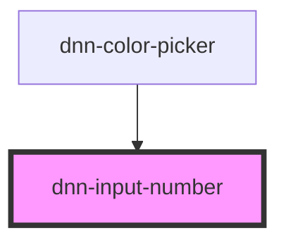

# dnn-input-number

<!-- Auto Generated Below -->

## Properties

| Property          | Attribute          | Description                                                                   | Type      | Default                   |
| ----------------- | ------------------ | ----------------------------------------------------------------------------- | --------- | ------------------------- |
| `ariaLabel`       | `aria-label`       | defined the aria label for screen readers using this control                  | `string`  | `"number value"`          |
| `max`             | `max`              | the maximum value                                                             | `number`  | `Number.MAX_SAFE_INTEGER` |
| `min`             | `min`              | the minimum value                                                             | `number`  | `0`                       |
| `shiftMultiplier` | `shift-multiplier` | determines the multiplier to use when using the controls with shift held down | `number`  | `10`                      |
| `step`            | `step`             | the amount to change the value when incrementing or decrementing              | `number`  | `1`                       |
| `useWheel`        | `use-wheel`        | determines if the mouse wheel is used to change values                        | `boolean` | `false`                   |
| `value`           | `value`            | the default value                                                             | `number`  | `0`                       |

## Events

| Event    | Description                      | Type               |
| -------- | -------------------------------- | ------------------ |
| `change` | fires when the value has changed | `CustomEvent<any>` |

## Dependencies

### Used by

 - [dnn-color-picker](..\dnn-color-picker)

### Graph

----------------------------------------------

*Built with [StencilJS](https://stenciljs.com/)*
