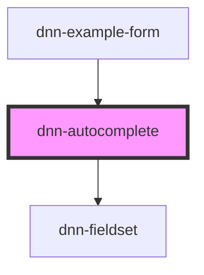

# dnn-autocomplete

<!-- Auto Generated Below -->

## Properties

| Property           | Attribute           | Description                                                                                                                                                                                           | Type                                                     | Default     |
| ------------------ | ------------------- | ----------------------------------------------------------------------------------------------------------------------------------------------------------------------------------------------------- | -------------------------------------------------------- | ----------- |
| `disabled`         | `disabled`          | Defines whether the field is disabled.                                                                                                                                                                | `boolean`                                                | `undefined` |
| `helpText`         | `help-text`         | Defines the help label displayed under the field.                                                                                                                                                     | `string`                                                 | `undefined` |
| `label`            | `label`             | The label for this autocomplete.                                                                                                                                                                      | `string`                                                 | `undefined` |
| `name`             | `name`              | The name for this autocomplete when used in forms.                                                                                                                                                    | `string`                                                 | `undefined` |
| `placeholder`      | `placeholder`       | Defines the placeholder for the autocomplete.                                                                                                                                                         | `string`                                                 | `undefined` |
| `renderSuggestion` | --                  | Callback to render suggestions, if not provided, only the label will be rendered.                                                                                                                     | `(suggestion: DnnAutocompleteSuggestion) => HTMLElement` | `undefined` |
| `required`         | `required`          | Defines whether the field requires having a value.                                                                                                                                                    | `boolean`                                                | `undefined` |
| `suggestions`      | --                  | Sets the list of suggestions.                                                                                                                                                                         | `DnnAutocompleteSuggestion[]`                            | `[]`        |
| `totalSuggestions` | `total-suggestions` | The total amount of suggestions for the given search query. This can be used to show virtual scroll and pagination progressive feeding. The needMoreItems event should be used to request more items. | `number`                                                 | `undefined` |
| `value`            | `value`             | Defines the value for this autocomplete                                                                                                                                                               | `string`                                                 | `undefined` |

## Events

| Event                | Description                                                                                                                                                                            | Type                                        |
| -------------------- | -------------------------------------------------------------------------------------------------------------------------------------------------------------------------------------- | ------------------------------------------- |
| `itemSelected`       | Fires when an item is selected.                                                                                                                                                        | `CustomEvent<string>`                       |
| `needMoreItems`      | Fires when the component needs to display more items in the suggestions.                                                                                                               | `CustomEvent<void>`                         |
| `searchQueryChanged` | Fires when the search query has changed. This is almost like valueInput, but it is debounced and can be used to trigger a search query without overloading API endpoints while typing. | `CustomEvent<string>`                       |
| `valueChange`        | Fires when the value has changed and the user exits the input.                                                                                                                         | `CustomEvent<number \| string \| string[]>` |
| `valueInput`         | Fires when the using is inputing data (on keystrokes).                                                                                                                                 | `CustomEvent<number \| string \| string[]>` |

## Methods

### `addSuggestions(suggestions: DnnAutocompleteSuggestion[]) => Promise<void>`

Adds suggestions to the list

#### Parameters

| Name          | Type                          | Description |
| ------------- | ----------------------------- | ----------- |
| `suggestions` | `DnnAutocompleteSuggestion[]` |             |

#### Returns

Type: `Promise<void>`

### `checkValidity() => Promise<ValidityState>`

Reports the input validity details. See https://developer.mozilla.org/en-US/docs/Web/API/ValidityState

#### Returns

Type: `Promise<ValidityState>`

### `setCustomValidity(message: string) => Promise<void>`

Can be used to set a custom validity message.

#### Parameters

| Name      | Type     | Description |
| --------- | -------- | ----------- |
| `message` | `string` |             |

#### Returns

Type: `Promise<void>`

## CSS Custom Properties

| Name                 | Description                                      |
| -------------------- | ------------------------------------------------ |
| `--background-color` | Defines the background color.                    |
| `--control-radius`   | Defines the radius for the control corners.      |
| `--danger-color`     | Defines the danger color used for invalid data.  |
| `--focus-color`      | Defines the color when the component is focused. |
| `--foreground-color` | Defines the foreground color.                    |

## Dependencies

### Used by

 - [dnn-example-form](../examples/dnn-example-form)

### Depends on

- [dnn-fieldset](../dnn-fieldset)

### Graph

----------------------------------------------

*Built with [StencilJS](https://stenciljs.com/)*
