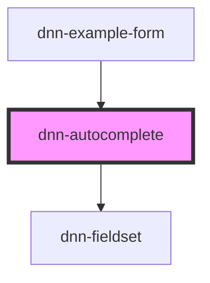

# dnn-autocomplete

Building a component that is flexible enough for multiple use cases is not easy. This component externalizes some of its behavior to make it more reusable. To use it effectivelly please read the usage examples carefuly.

## Most Basic Usage
You need to at least provide the list of items and refresh the results with your own logic for the searched terms. Suggestions are not just strings, they are an object with a `value` and a `label`. If you are in a typed environment, `DnnAutocompleteSuggestion` is the type to use for individual suggestions. The label is what shows to the user and the value is what gets posted in both events and form values. The `onSearchQueryChanged` event lets you know to refresh your list of suggestions.

Data can be a harcoded list or an API call or whatever makes sense for your use case.

## Customizing the display of items
We have made it so the consumer can totally customize how suggestions are displayed, this is a very powerful feature that makes this component very reusable. If not customized, the out-of-box experience is to just display the label in plain text in the dropdown. But you can hook into the `renderSuggestion` callback to override that default behavior. You receive the suggestion item and return the html to display.

<!-- Auto Generated Below -->


## Usage

### HTML

#### Most Basic Usage
```html
<script type="text/javascript">
document.addEventListener("DOMContentLoaded", () => {
    var dnnAutoComplete = document.querySelector("#dnnAutoComplete");

    var suggestions =
    [
        { value: "1", label: "johnsmith" },
        { value: "2", label: "sarahjones" },
        { value: "3", label: "mikeross" },
        { value: "4", label: "emilyclark" },
        { value: "5", label: "davemiller" },
        { value: "6", label: "lindagreen" },
        { value: "7", label: "chrisevans" },
        { value: "8", label: "lisawhite" },
        { value: "9", label: "tomharris" },
        { value: "10", label: "jennymoore" }
    ];

    dnnAutoComplete.addEventListener("searchQueryChanged", query => {
        if (query == undefined || query == ""){
            dnnAutoComplete.suggestions = this.suggestions;
            return;
        }
        dnnAutoComplete.suggestions = this.suggestions.filter(user => 
            user.label.toLowerCase().includes(query.toLowerCase));
    })
});
</script>

<dnn-autocomplete
    label="UserName"
    id="dnnAutoComplete"
    suggestions={this.filteredSuggestions}
    onSearchQueryChanged={e => this.handleSearchQueryChanged(e.detail)}
/>
```

#### Customizing the display of items
```html
<script type="text/javascript">
    document.addEventListener("DOMContentLoaded", () => {
        var dnnAutoComplete = document.querySelector("#dnnAutoComplete");

        dnnAutoComplete.renderSuggesion = function(suggestion){
            var user = // Some logic that gets a user info...

            var div = document.createElement("div");
            div.style="display: flex";
            var img = document.createElement("img");
            img.src = user.profilePic;
            div.appendChild(img);
            var span = document.createElement("span");
            span.innerText = user.firstName + " " + user.lastName;
            div.appendChild(span);
            return div;
        };
    });
</script>

<dnn-autocomplete
    id="dnnAutoComplete"
/>
```

#### Using a paging API
```html
<script type="text/javascript">
document.addEventListener("DOMContentLoaded", () => {
    var dnnAutoComplete = document.querySelector("#dnnAutoComplete");

    var lastFetchedPage = 0;
    var suggestions = [];

    dnnAutoComplete.addEventListener("searchChanged", e => 
    {
        var query = e.detail;
        fetch(`https://some.endpoint.com/search/${query}`)
        .then(response => response.json())
        .then(data => {
            lastFetchedPage = 1;
            dnnAutoComplete.totalSuggestions = data.totalResults;
            suggestions = data.results;
            dnnAutoComplete.suggestions = suggestions;
        });
    });

    dnnAutoComplete.addEventListener("NeedMoreItems", () =>
    {
        fetch(`https://some.endpoint.com/search/${query}/page=${lastFetchedPage + 1}`)
        .then(response => response.json())
        .then(data => {
            lastFetchedPage++;
            suggestions.push(data.results);
            dnnAutoComplete.suggestions = suggestions;
        });
    });
});
</script>

<dnn-autocomplete
    id="dnnAutoComplete"
/>
```


### JSX-TSX

#### Most Basic Usage
```tsx
const suggestions =
[
    { value: "1", label: "johnsmith" },
    { value: "2", label: "sarahjones" },
    { value: "3", label: "mikeross" },
    { value: "4", label: "emilyclark" },
    { value: "5", label: "davemiller" },
    { value: "6", label: "lindagreen" },
    { value: "7", label: "chrisevans" },
    { value: "8", label: "lisawhite" },
    { value: "9", label: "tomharris" },
    { value: "10", label: "jennymoore" }
];

let filteredSuggestions = suggestions;

private handleSearchQueryChanged(query){
    if (query == undefined || query == ""){
        this.filteredSuggestions = this.suggestions;
        return;
    }
    this.filteredSuggestions = this.suggestions.filter(user => 
        user.label.toLowerCase().includes(query.toLowerCase));
}

render(){
    return(
        <dnn-autocomplete
            label="UserName"
            suggestions={this.filteredSuggestions}
            onSearchQueryChanged={e => this.handleSearchQueryChanged(e.detail)}
        />
    )
}
```

#### Customizing the display of items
```tsx
private handleRenderSuggestion(suggestion){
    var user = this.getUserDetails(suggestion.value)
    return(
        <div style="display: flex;">
            
            <span>{user.firstName} {user.lastName}</span>
        </div>
    );
}

private getUserDetails(userId){
    return // Some logic that returns a user object...
}

render(){
    return(
        <dnn-autocomplete
            // Some other props
            renderSuggestion={suggestion => this.handleRenderSuggestion(suggestion)}
        />
    );
}
```

#### Using a paging API
```tsx
let lastFetchedPage = 0;
let totalSuggesitons = 0;
let suggestions = [];

private handleSearchChanged(query){
    fetch(`https://some.endpoint.com/search/${query}`)
    .then(response => response.json())
    .then(data => {
        this.lastFetchedPage = 1;
        this.totalSuggestion = data.totalResults;
        this.suggestions = data.results;
    });
}

private handleLoadMore(query){
    fetch(`https://some.endpoint.com/search/${query}/page=${this.lastFetchedPage + 1}`)
    .then(response => response.json())
    .then(data => {
        this.lastFetchedPage++;
        this.suggestions = [...this.suggestions, data.results];
    });
}

<dnn-autocomplete
    suggestions={this.suggestions}
    totalSuggestions={this.totalSuggestions}
    onSearchQueryChanged={e => {
        this.handleSearchChanged(e.detail);
    }}
    onNeedMoreItems={e => this.loadMore(e.detail.searchTerm)}
/>
```


## Properties

| Property                 | Attribute                  | Description                                                                                                                                                                                           | Type                                                     | Default     |
| ------------------------ | -------------------------- | ----------------------------------------------------------------------------------------------------------------------------------------------------------------------------------------------------- | -------------------------------------------------------- | ----------- |
| `disabled`               | `disabled`                 | Defines whether the field is disabled.                                                                                                                                                                | `boolean`                                                | `undefined` |
| `helpText`               | `help-text`                | Defines the help label displayed under the field.                                                                                                                                                     | `string`                                                 | `undefined` |
| `label`                  | `label`                    | The label for this autocomplete.                                                                                                                                                                      | `string`                                                 | `undefined` |
| `name`                   | `name`                     | The name for this autocomplete when used in forms.                                                                                                                                                    | `string`                                                 | `undefined` |
| `preloadThresholdPixels` | `preload-threshold-pixels` | How many suggestions to preload in pixels of their height. This is used to calculate the virtual scroll height and request more items before they get into view.                                      | `number`                                                 | `1000`      |
| `renderSuggestion`       | --                         | Callback to render suggestions, if not provided, only the label will be rendered.                                                                                                                     | `(suggestion: DnnAutocompleteSuggestion) => HTMLElement` | `undefined` |
| `required`               | `required`                 | Defines whether the field requires having a value.                                                                                                                                                    | `boolean`                                                | `undefined` |
| `suggestions`            | --                         | Sets the list of suggestions.                                                                                                                                                                         | `DnnAutocompleteSuggestion[]`                            | `[]`        |
| `totalSuggestions`       | `total-suggestions`        | The total amount of suggestions for the given search query. This can be used to show virtual scroll and pagination progressive feeding. The needMoreItems event should be used to request more items. | `number`                                                 | `undefined` |
| `value`                  | `value`                    | Defines the value for this autocomplete                                                                                                                                                               | `string`                                                 | `undefined` |


## Events

| Event                | Description                                                                                                                                                                            | Type                                        |
| -------------------- | -------------------------------------------------------------------------------------------------------------------------------------------------------------------------------------- | ------------------------------------------- |
| `itemSelected`       | Fires when an item is selected.                                                                                                                                                        | `CustomEvent<string>`                       |
| `needMoreItems`      | Fires when the component needs to display more items in the suggestions.                                                                                                               | `CustomEvent<NeedMoreItemsEventArgs>`       |
| `searchQueryChanged` | Fires when the search query has changed. This is almost like valueInput, but it is debounced and can be used to trigger a search query without overloading API endpoints while typing. | `CustomEvent<string>`                       |
| `valueChange`        | Fires when the value has changed and the user exits the input.                                                                                                                         | `CustomEvent<number \| string \| string[]>` |
| `valueInput`         | Fires when the using is inputing data (on keystrokes).                                                                                                                                 | `CustomEvent<number \| string \| string[]>` |


## Methods

### `checkValidity() => Promise<ValidityState>`

Reports the input validity details. See https://developer.mozilla.org/en-US/docs/Web/API/ValidityState

#### Returns

Type: `Promise<ValidityState>`


### `setCustomValidity(message: string) => Promise<void>`

Can be used to set a custom validity message.

#### Parameters

| Name      | Type     | Description |
| --------- | -------- | ----------- |
| `message` | `string` |             |

#### Returns

Type: `Promise<void>`


## CSS Custom Properties

| Name                 | Description                                      |
| -------------------- | ------------------------------------------------ |
| `--background-color` | Defines the background color.                    |
| `--control-radius`   | Defines the radius for the control corners.      |
| `--danger-color`     | Defines the danger color used for invalid data.  |
| `--focus-color`      | Defines the color when the component is focused. |
| `--foreground-color` | Defines the foreground color.                    |


## Dependencies

### Used by

 - [dnn-example-form](../examples/dnn-example-form)

### Depends on

- [dnn-fieldset](../dnn-fieldset)

### Graph


----------------------------------------------

*Built with [StencilJS](https://stenciljs.com/)*
