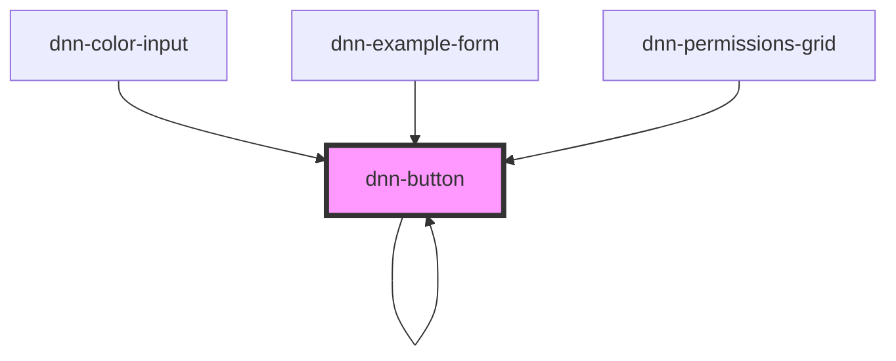

# dnn-button

<!-- Auto Generated Below -->

## Properties

| Property         | Attribute          | Description                                                                                                                                                                                                   | Type                                                 | Default            |
| ---------------- | ------------------ | ------------------------------------------------------------------------------------------------------------------------------------------------------------------------------------------------------------- | ---------------------------------------------------- | ------------------ |
| `confirm`        | `confirm`          | Optionally add a confirmation dialog before firing the action.                                                                                                                                                | `boolean`                                            | `false`            |
| `confirmMessage` | `confirm-message`  | The text of the confirmation message;                                                                                                                                                                         | `string`                                             | `"Are you sure ?"` |
| `confirmNoText`  | `confirm-no-text`  | The text of the no button for confirmation.                                                                                                                                                                   | `string`                                             | `"No"`             |
| `confirmYesText` | `confirm-yes-text` | The text of the yes button for confirmation.                                                                                                                                                                  | `string`                                             | `"Yes"`            |
| `disabled`       | `disabled`         | Disables the button                                                                                                                                                                                           | `boolean`                                            | `false`            |
| `formButtonType` | `form-button-type` | Optional button type, can be either submit, reset or button and defaults to button if not specified. Warning: DNN wraps the whole page in a form, only use this if you are handling form submission manually. | `"button" \| "reset" \| "submit"`                    | `'button'`         |
| `reversed`       | `reversed`         | Optionally reverses the button style.                                                                                                                                                                         | `boolean`                                            | `false`            |
| `size`           | `size`             | Optionally sets the button size, small normal or large, defaults to normal                                                                                                                                    | `"large" \| "normal" \| "small"`                     | `'normal'`         |
| `type`           | `type`             | Optional button style, can be either primary, secondary or tertiary or danger and defaults to primary if not specified                                                                                        | `"danger" \| "primary" \| "secondary" \| "tertiary"` | `'primary'`        |

## Events

| Event       | Description                                                  | Type               |
| ----------- | ------------------------------------------------------------ | ------------------ |
| `canceled`  | Fires when confirm is true and the user cancels the action.  | `CustomEvent<any>` |
| `confirmed` | Fires when confirm is true and the user confirms the action. | `CustomEvent<any>` |

## Slots

| Slot                      | Description |
| ------------------------- | ----------- |
| `"Content of the button"` |             |

## CSS Custom Properties

| Name                 | Description                         |
| -------------------- | ----------------------------------- |
| `--background-color` | The background color of the button. |
| `--border-color`     | The border color of the button.     |
| `--border-radius`    | The border radius of the button.    |
| `--border-size`      | The border size of the button.      |
| `--color`            | The text color of the button.       |
| `--padding`          | The padding of the button.          |

## Dependencies

### Used by

 - [dnn-button](.)
 - [dnn-color-input](../dnn-color-input)
 - [dnn-example-form](../examples/dnn-example-form)
 - [dnn-permissions-grid](../dnn-permissions-grid)

### Depends on

- [dnn-modal](../dnn-modal)
- [dnn-button](.)

### Graph

----------------------------------------------

*Built with [StencilJS](https://stenciljs.com/)*
