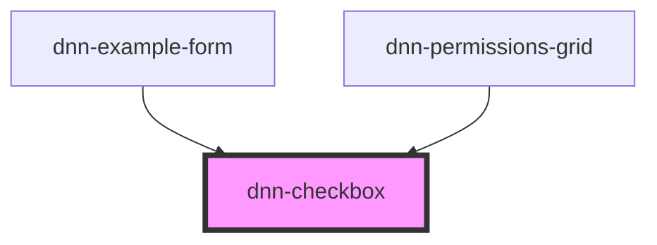

# dnn-checkbox


<!-- Auto Generated Below -->


## Usage

### HTML

```html
<dnn-checkbox
    checked="unchecked"
    name="agree"
    value="1"
    use-intermediate="false">
</dnn-checkbox>
```


### JSX-TSX

```tsx
<dnn-checkbox
    checked="unchecked"
    name="agree"
    value="1"
    useIntermediate="false">
</dnn-checkbox>
```


## Properties

| Property           | Attribute            | Description                                                                                                                                                                                                                                             | Type                                           | Default                                                        |
| ------------------ | -------------------- | ------------------------------------------------------------------------------------------------------------------------------------------------------------------------------------------------------------------------------------------------------- | ---------------------------------------------- | -------------------------------------------------------------- |
| `checked`          | `checked`            | Defines if the checkbox is checked (true) or unchecked (false) or in an intermediate state (undefined)                                                                                                                                                  | `"checked" \| "intermediate" \| "unchecked"`   | `"unchecked"`                                                  |
| `name`             | `name`               | The name to show in the formData (if using forms).                                                                                                                                                                                                      | `string`                                       | `""`                                                           |
| `nextStateHandler` | `next-state-handler` | A function that will be called when the checkbox needs to change state and returns the next state. Can be used to customize the order of the states when the component is clicked. Only called if you also use the tri-state feature (useIntermediate). | `(currentState: CheckedState) => CheckedState` | `(currentState) => this.defaultNextStateHandler(currentState)` |
| `required`         | `required`           | If true, the checkbox needs to be checked for the form validation to succeed.                                                                                                                                                                           | `boolean`                                      | `false`                                                        |
| `requiredMessage`  | `required-message`   | Can be used to customize the validation message when the field is required but not checked.                                                                                                                                                             | `string`                                       | `"The checkbox must be checked"`                               |
| `useIntermediate`  | `use-intermediate`   | Defines if clicking the checkbox will go through the intermediate state between checked and unchecked (tri-state)                                                                                                                                       | `boolean`                                      | `false`                                                        |
| `value`            | `value`              | The value for this checkbox (not to be confused with its checked state).                                                                                                                                                                                | `string`                                       | `"on"`                                                         |


## Events

| Event           | Description                                          | Type                                                      |
| --------------- | ---------------------------------------------------- | --------------------------------------------------------- |
| `checkedchange` | Fires up when the checkbox checked property changes. | `CustomEvent<"checked" \| "intermediate" \| "unchecked">` |


## Methods

### `checkValidity() => Promise<ValidityState>`

Reports the input validity details. See https://developer.mozilla.org/en-US/docs/Web/API/ValidityState

#### Returns

Type: `Promise<ValidityState>`


## Slots

| Slot                 | Description                                                |
| -------------------- | ---------------------------------------------------------- |
| `"checkedicon"`      | Allows overriding the default checked icon.                |
| `"intermediateicon"` | If intermadiate state is used, allows overriding its icon. |
| `"uncheckedicon"`    | Allows overriding the unchecked icon.                      |


## CSS Custom Properties

| Name            | Description                                                                                  |
| --------------- | -------------------------------------------------------------------------------------------- |
| `--focus-color` | The color to outline the checkbox when hovered or focused, default to the dnn primary color. |


## Dependencies

### Used by

 - [dnn-example-form](../examples/dnn-example-form)
 - [dnn-permissions-grid](../dnn-permissions-grid)

### Graph


----------------------------------------------

*Built with [StencilJS](https://stenciljs.com/)*
