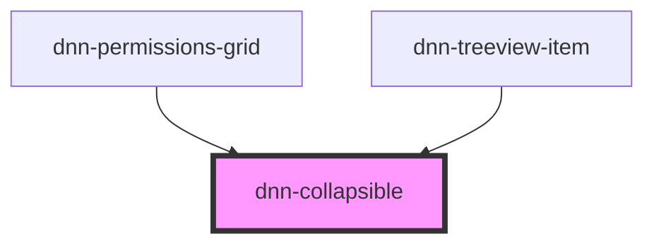

# dnn-collapsible


<!-- Auto Generated Below -->


## Usage

### HTML

```html
<div class="collapse-row">
    <style type="text/css">
        .collapse-row{
            border: 1px solid grey;
        }
        .collapse-row .collapse-title{
            display:flex;
            align-items: center;
            background-color: whitesmoke;
        }
        .collapse-row .collapse-title>*{
            margin: 10px;
        }
    </style>
    <div class="collapse-title">
        <dnn-chevron id="dnn-chevron1" expanded="false"></dnn-chevron>
    <strong>Collapsible Panel</strong>
    </div>
    <dnn-collapsible id="dnn-collapsible1" expanded="false" transition-duration="300">
        <div id="collapsible-slot-content" style="padding: 15px;">
            <h2>Details</h2>
            <p>
                Spicy jalapeno bacon ipsum dolor amet bresaola kielbasa doner ham hock biltong, swine shoulder leberkas cupim. Sausage capicola buffalo, tongue jerky frankfurter biltong pork swine landjaeger. Porchetta alcatra burgdoggen beef ribs short ribs corned beef, biltong flank bresaola kielbasa. Ham hock beef kielbasa, cupim cow beef ribs doner. T-bone cow shoulder chuck pastrami. Alcatra pig filet mignon shank. Pancetta shankle meatloaf sausage meatball cupim.
            </p>
        </div>
    </dnn-collapsible>
</div>
```


### JSX-TSX

```tsx
<div class="collapse-row">
    <style type="text/css">
        .collapse-row{
            border: 1px solid grey;
        }
        .collapse-row .collapse-title{
            display:flex;
            align-items: center;
            background-color: whitesmoke;
        }
        .collapse-row .collapse-title>*{
            margin: 10px;
        }
    </style>
    <div class="collapse-title">
        <dnn-chevron id="dnn-chevron1" expanded="false"></dnn-chevron>
    <strong>Collapsible Panel</strong>
    </div>
    <dnn-collapsible id="dnn-collapsible1" expanded="false" transitionDuration="300">
        <div id="collapsible-slot-content" style="padding: 15px;">
            <h2>Details</h2>
            <p>
                Spicy jalapeno bacon ipsum dolor amet bresaola kielbasa doner ham hock biltong, swine shoulder leberkas cupim. Sausage capicola buffalo, tongue jerky frankfurter biltong pork swine landjaeger. Porchetta alcatra burgdoggen beef ribs short ribs corned beef, biltong flank bresaola kielbasa. Ham hock beef kielbasa, cupim cow beef ribs doner. T-bone cow shoulder chuck pastrami. Alcatra pig filet mignon shank. Pancetta shankle meatloaf sausage meatball cupim.
            </p>
        </div>
    </dnn-collapsible>
</div>
```


## Properties

| Property             | Attribute             | Description                                          | Type      | Default |
| -------------------- | --------------------- | ---------------------------------------------------- | --------- | ------- |
| `expanded`           | `expanded`            | Defines if the panel is expanded or not.             | `boolean` | `false` |
| `transitionDuration` | `transition-duration` | Defines the transition time in ms, defaults to 150ms | `number`  | `150`   |


## Events

| Event                         | Description                                       | Type                |
| ----------------------------- | ------------------------------------------------- | ------------------- |
| `dnnCollapsibleHeightChanged` | Fires whenever the collapsible height has changed | `CustomEvent<void>` |


## Methods

### `updateSize() => Promise<void>`

Updates the component height, use to update after a slot content changes.

#### Returns

Type: `Promise<void>`


## Dependencies

### Used by

 - [dnn-permissions-grid](../dnn-permissions-grid)
 - [dnn-treeview-item](../dnn-treeview-item)

### Graph


----------------------------------------------

*Built with [StencilJS](https://stenciljs.com/)*
