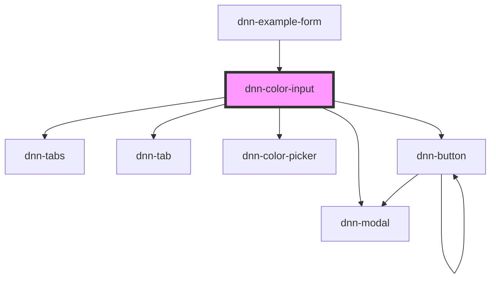

# dnn-color-input

<!-- Auto Generated Below -->

## Overview

A custom input component that allows previewing and changing a color value.

## Properties

| Property           | Attribute            | Description                                                                                         | Type                                                                                                                   | Default                                                                                                                                                             |
| ------------------ | -------------------- | --------------------------------------------------------------------------------------------------- | ---------------------------------------------------------------------------------------------------------------------- | ------------------------------------------------------------------------------------------------------------------------------------------------------------------- |
| `color`            | `color`              | Sets the initial color, must be a valid 8 character hexadecimal string without the # sign.          | `string`                                                                                                               | `"000088"`                                                                                                                                                          |
| `contrastColor`    | `contrast-color`     | Sets the initial contrast color, must be a valid 8 character hexadecimal string without the # sign. | `string`                                                                                                               | `"FFFFFF"`                                                                                                                                                          |
| `darkColor`        | `dark-color`         | Sets the initial dark color, must be a valid 8 character hexadecimal string without the # sign.     | `string`                                                                                                               | `"0000044"`                                                                                                                                                         |
| `helpText`         | `help-text`          | Defines the help label displayed under the field.                                                   | `string`                                                                                                               | `undefined`                                                                                                                                                         |
| `label`            | `label`              | The label for this input.                                                                           | `string`                                                                                                               | `undefined`                                                                                                                                                         |
| `lightColor`       | `light-color`        | Sets the initial light color, must be a valid 8 character hexadecimal string without the # sign.    | `string`                                                                                                               | `"00000FF"`                                                                                                                                                         |
| `localization`     | --                   | Can be used to customize the text language.                                                         | `{ contrast: string; preview: string; cancel: string; confirm: string; normal: string; light: string; dark: string; }` | `{     contrast: "Contrast",     preview: "Preview",     cancel: "Cancel",     confirm: "Confirm",     normal: "Normal",     light: "Light",     dark: "Dark",   }` |
| `name`             | `name`               | The name for this input if forms are used.                                                          | `string`                                                                                                               | `undefined`                                                                                                                                                         |
| `readonly`         | `readonly`           | Disables interacting with the component.                                                            | `boolean`                                                                                                              | `undefined`                                                                                                                                                         |
| `useContrastColor` | `use-contrast-color` | If true, the picker will allow selecting a contast color too.                                       | `boolean`                                                                                                              | `undefined`                                                                                                                                                         |
| `useDarkColor`     | `use-dark-color`     | If true, the picker will allow selecting a dark color too.                                          | `boolean`                                                                                                              | `undefined`                                                                                                                                                         |
| `useLightColor`    | `use-light-color`    | If true, the picker will allow selecting a light color too.                                         | `boolean`                                                                                                              | `undefined`                                                                                                                                                         |

## Events

| Event         | Description                                                      | Type                        |
| ------------- | ---------------------------------------------------------------- | --------------------------- |
| `colorChange` | Fires when the color was changed and confirmed.                  | `CustomEvent<DnnColorInfo>` |
| `colorInput`  | Fires live as the user is trying color changes inside the modal. | `CustomEvent<DnnColorInfo>` |

## Slots

| Slot       | Description                                           |
| ---------- | ----------------------------------------------------- |
| `"prefix"` | Can be used to inject content before the input field. |
| `"suffix"` | Can be used to inject content after the input field.  |

## CSS Custom Properties

| Name                   | Description                                                          |
| ---------------------- | -------------------------------------------------------------------- |
| `--background`         | Defines the background color.                                        |
| `--contast-text-align` | Allows customizing the text alignment of the contast indicator text. |
| `--control-radius`     | Defines the radius for the control corners.                          |
| `--focus-color`        | Defines the color when the component is focused.                     |
| `--foreground`         | Defines the foreground color.                                        |

## Dependencies

### Used by

 - [dnn-example-form](../examples/dnn-example-form)

### Depends on

- [dnn-modal](../dnn-modal)
- [dnn-tabs](../dnn-tabs)
- [dnn-tab](../dnn-tab)
- [dnn-color-picker](../dnn-color-picker)
- [dnn-button](../dnn-button)

### Graph

----------------------------------------------

*Built with [StencilJS](https://stenciljs.com/)*
