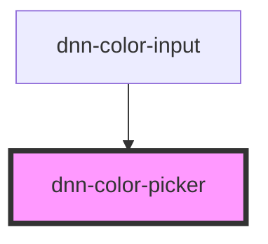

# dnn-color-picker


<!-- Auto Generated Below -->


## Overview

Color Picker for Dnn

## Usage

### HTML

```html
<dnn-color-picker
    color="FFFFFF"
    color-box-height="50%"
>
</dnn-color-picker>
```


### JSX-TSX

```tsx
<dnn-color-picker
    color="FFFFFF"
    colorBoxHeight="50%"
>
</dnn-color-picker>
```


## Properties

| Property         | Attribute          | Description                                                                                | Type     | Default    |
| ---------------- | ------------------ | ------------------------------------------------------------------------------------------ | -------- | ---------- |
| `color`          | `color`            | Sets the initial color, must be a valid 8 character hexadecimal string without the # sign. | `string` | `"FFFFFF"` |
| `colorBoxHeight` | `color-box-height` | Sets the width-height ratio of the color picker saturation-lightness box.                  | `string` | `"50%"`    |


## Events

| Event          | Description                                                     | Type                     |
| -------------- | --------------------------------------------------------------- | ------------------------ |
| `colorChanged` | Fires up when the color is changed and emits a ColorInfo object | `CustomEvent<ColorInfo>` |


## Dependencies

### Used by

 - [dnn-color-input](../dnn-color-input)

### Graph


----------------------------------------------

*Built with [StencilJS](https://stenciljs.com/)*
