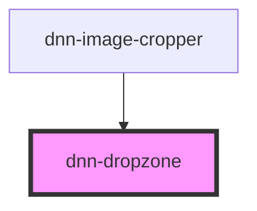

# dnn-dropzone

<!-- Auto Generated Below -->

## Properties

| Property            | Attribute           | Description                                                                                                                                   | Type                                                                                                                                                           | Default                                                                                                                                                                                                                                                                        |
| ------------------- | ------------------- | --------------------------------------------------------------------------------------------------------------------------------------------- | -------------------------------------------------------------------------------------------------------------------------------------------------------------- | ------------------------------------------------------------------------------------------------------------------------------------------------------------------------------------------------------------------------------------------------------------------------------ |
| `allowCameraMode`   | `allow-camera-mode` | If true, will allow the user to take a snapshot using the device camera. (only works over https).                                             | `boolean`                                                                                                                                                      | `false`                                                                                                                                                                                                                                                                        |
| `allowedExtensions` | --                  | A list of allowed file extensions. If not specified, any file is allowed. Ex: ["jpg", "jped", "gif", "png"]                                   | `string[]`                                                                                                                                                     | `undefined`                                                                                                                                                                                                                                                                    |
| `captureQuality`    | `capture-quality`   | Specifies the jpeg quality for when the device camera is used to generate a picture. Needs to be a number between 0 and 1 and defaults to 0.8 | `number`                                                                                                                                                       | `0.8`                                                                                                                                                                                                                                                                          |
| `maxFileSize`       | `max-file-size`     | Max file size in bytes.                                                                                                                       | `number`                                                                                                                                                       | `undefined`                                                                                                                                                                                                                                                                    |
| `resx`              | --                  | Localization strings                                                                                                                          | `{ dragAndDropFile?: string; capture?: string; or?: string; takePicture?: string; uploadFile?: string; uploadSizeTooLarge?: string; fileSizeLimit?: string; }` | `{     dragAndDropFile: "Drag and drop a file",     capture: "Capture",     or: "or",     takePicture: "Take a picture",     uploadFile: "Upload a file",     uploadSizeTooLarge: "The file you tried to upload is too large.",     fileSizeLimit: "The maximum size is",   }` |

## Events

| Event           | Description                    | Type                  |
| --------------- | ------------------------------ | --------------------- |
| `filesSelected` | Fires when file were selected. | `CustomEvent<File[]>` |

## CSS Custom Properties

| Name                      | Description                                          |
| ------------------------- | ---------------------------------------------------- |
| `--border-color`          | The color of the border.                             |
| `--border-radius`         | The radius of the controls borders.                  |
| `--drop-background-color` | The color of the background when a file is dropping. |

## Dependencies

### Used by

 - [dnn-image-cropper](../dnn-image-cropper)

### Graph

----------------------------------------------

*Built with [StencilJS](https://stenciljs.com/)*
