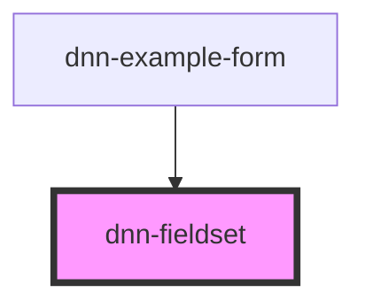

# dnn-fieldset

<!-- Auto Generated Below -->

## Overview

A custom input component that wraps the html input element is a mobile friendly component that supports a label, some help text and other features.

## Properties

| Property     | Attribute     | Description                                                                  | Type      | Default     |
| ------------ | ------------- | ---------------------------------------------------------------------------- | --------- | ----------- |
| `disabled`   | `disabled`    | If true, the fieldset will display as disabled.                              | `boolean` | `undefined` |
| `floatLabel` | `float-label` | If true, the label will float in the container, set false to show it on top. | `boolean` | `undefined` |
| `focused`    | `focused`     | If true the fieldset will display as focused.                                | `boolean` | `undefined` |
| `helpText`   | `help-text`   | Can be used to show some help text about this field.                         | `string`  | `undefined` |
| `invalid`    | `invalid`     | If true, the  fieldset will display as invalid.                              | `boolean` | `undefined` |
| `label`      | `label`       | Sets the text of the fieldset label (caption).                               | `string`  | `undefined` |

## Methods

### `disable() => Promise<void>`

Sets the fieldset to a disabled state.

#### Returns

Type: `Promise<void>`

### `enable() => Promise<void>`

Sets the fieldset to an enabled state.

#### Returns

Type: `Promise<void>`

### `pinLabel() => Promise<void>`

Places the label on the top of the container.

#### Returns

Type: `Promise<void>`

### `setBlurred() => Promise<void>`

Unsets the fieldset focused state.

#### Returns

Type: `Promise<void>`

### `setFocused() => Promise<void>`

Sets the fieldset to the focused state.

#### Returns

Type: `Promise<void>`

### `setValidity(valid: boolean, message?: string) => Promise<void>`

Sets the validity of the field.

#### Parameters

| Name      | Type      | Description |
| --------- | --------- | ----------- |
| `valid`   | `boolean` |             |
| `message` | `string`  |             |

#### Returns

Type: `Promise<void>`

### `unpinLabel() => Promise<void>`

Places the label in the vertical middle of the container.

#### Returns

Type: `Promise<void>`

## Slots

| Slot             | Description                                    |
| ---------------- | ---------------------------------------------- |
| `"label-prefix"` | Can be used to inject content before the labe. |
| `"label-suffix"` | Can be used to inject content after the label. |

## CSS Custom Properties

| Name               | Description                                      |
| ------------------ | ------------------------------------------------ |
| `--background`     | Defines the background color.                    |
| `--control-radius` | Defines the radius for the control corners.      |
| `--danger-color`   | Defines the danger color used for invalid data.  |
| `--focus-color`    | Defines the color when the component is focused. |
| `--foreground`     | Defines the foreground color.                    |

## Dependencies

### Used by

 - [dnn-example-form](../examples/dnn-example-form)

### Graph

----------------------------------------------

*Built with [StencilJS](https://stenciljs.com/)*
