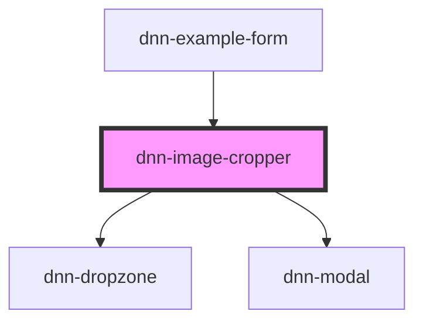

# dnn-image-cropper

<!-- Auto Generated Below -->

## Overview

Allows cropping an image in-browser with the option to enforce a specific final size.
All computation happens in the browser and the final image is emmited
in an event that has a data-url of the image.

## Properties

| Property            | Attribute            | Description                                                                                                                                 | Type                            | Default     |
| ------------------- | -------------------- | ------------------------------------------------------------------------------------------------------------------------------------------- | ------------------------------- | ----------- |
| `height`            | `height`             | Sets the desired final image height.                                                                                                        | `number \| undefined`           | `undefined` |
| `name`              | `name`               | The name of the control when used in a form.                                                                                                | `string \| undefined`           | `undefined` |
| `preventUndersized` | `prevent-undersized` | When set to true, prevents cropping an image smaller than the required size, which would blow pixel and make the final picture look blurry. | `boolean`                       | `false`     |
| `quality`           | `quality`            | Sets the output quality of the cropped image (number between 0 and 1).                                                                      | `number`                        | `0.8`       |
| `resx`              | `resx`               | Can be used to customize controls text. Some values support tokens, see default values for examples.                                        | `ImageCropperResx \| undefined` | `undefined` |
| `width`             | `width`              | Sets the desired final image width.                                                                                                         | `number \| undefined`           | `undefined` |

## Events

| Event                  | Description                                                                                                                                                                                                          | Type                  |
| ---------------------- | -------------------------------------------------------------------------------------------------------------------------------------------------------------------------------------------------------------------- | --------------------- |
| `imageCropChanged`     | When the image crop changes, emits the dataurl for the new cropped image.                                                                                                                                            | `CustomEvent<string>` |
| `imageFileCropChanged` | Emits both when a file is initially select and when the crop has changed. Compared to imageCropChanged, this event emits the file itself, which can be useful for uploading the file to a server including its name. | `CustomEvent<File>`   |

## Methods

### `clear() => Promise<void>`

Clears the current image and crop (resets the component).

#### Returns

Type: `Promise<void>`

## Dependencies

### Used by

 - [dnn-example-form](../examples/dnn-example-form)

### Depends on

- [dnn-dropzone](../dnn-dropzone)
- [dnn-modal](../dnn-modal)

### Graph

----------------------------------------------

*Built with [StencilJS](https://stenciljs.com/)*
