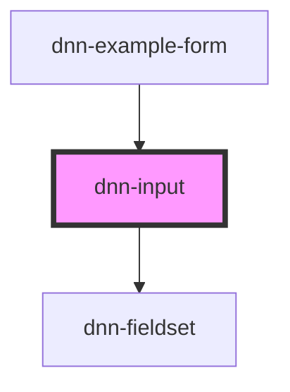

# dnn-input

<!-- Auto Generated Below -->

## Overview

A custom input component that wraps the html input element is a mobile friendly component that supports a label, some help text and other features.

## Properties

| Property                   | Attribute                    | Description                                                                                                                                                                                       | Type                                                                                                                | Default     |
| -------------------------- | ---------------------------- | ------------------------------------------------------------------------------------------------------------------------------------------------------------------------------------------------- | ------------------------------------------------------------------------------------------------------------------- | ----------- |
| `allowShowPassword`        | `allow-show-password`        | If true, enables users to switch between a password and a text field (to view their password).                                                                                                    | `boolean \| undefined`                                                                                              | `undefined` |
| `autocomplete`             | `autocomplete`               | Defines the type of auto-completion to use for this field, see https://developer.mozilla.org/en-US/docs/Web/HTML/Attributes/autocomplete.                                                         | `string`                                                                                                            | `"off"`     |
| `disableValidityReporting` | `disable-validity-reporting` | **[DEPRECATED]** This control has it's own validation reporting, will be removed in v0.25.0                                                                | `boolean \| undefined`                                                                                              | `undefined` |
| `disabled`                 | `disabled`                   | Defines whether the field is disabled.                                                                                                                                                            | `boolean \| undefined`                                                                                              | `undefined` |
| `helpText`                 | `help-text`                  | Defines the help label displayed under the field.                                                                                                                                                 | `string \| undefined`                                                                                               | `undefined` |
| `inputmode`                | `inputmode`                  | Hints at the type of data that might be entered by the user while editing the element or its contents. This allows a browser to display an appropriate virtual keyboard.                          | `"decimal" \| "email" \| "none" \| "numeric" \| "search" \| "tel" \| "text" \| "url" \| undefined`                  | `undefined` |
| `label`                    | `label`                      | The label for this input.                                                                                                                                                                         | `string \| undefined`                                                                                               | `undefined` |
| `max`                      | `max`                        | Defines the maximum allowed value.                                                                                                                                                                | `number \| string \| undefined`                                                                                     | `undefined` |
| `maxlength`                | `maxlength`                  | Defines the maximum amount of charaters.                                                                                                                                                          | `number \| undefined`                                                                                               | `undefined` |
| `min`                      | `min`                        | Defines the minimum allowed value.                                                                                                                                                                | `number \| string \| undefined`                                                                                     | `undefined` |
| `minlength`                | `minlength`                  | Defines the minimum amount of charaters.                                                                                                                                                          | `number \| undefined`                                                                                               | `undefined` |
| `multiple`                 | `multiple`                   | If true, allows multiple emails to be entered separated by commas.                                                                                                                                | `boolean \| undefined`                                                                                              | `undefined` |
| `name`                     | `name`                       | The name for this input when used in forms.                                                                                                                                                       | `string \| undefined`                                                                                               | `undefined` |
| `pattern`                  | `pattern`                    | Valid for text, search, url, tel, email, and password, the pattern attribute defines a regular expression that the input's value must match in order for the value to pass constraint validation. | `string \| undefined`                                                                                               | `undefined` |
| `readonly`                 | `readonly`                   | Defines wheter the defined value is readonly.                                                                                                                                                     | `boolean \| undefined`                                                                                              | `undefined` |
| `required`                 | `required`                   | Defines whether the field requires having a value.                                                                                                                                                | `boolean \| undefined`                                                                                              | `undefined` |
| `step`                     | `step`                       | Defines the possible steps for numbers and dates/times. See https://developer.mozilla.org/en-US/docs/Web/HTML/Element/input/date#step                                                             | `number \| string \| undefined`                                                                                     | `undefined` |
| `type`                     | `type`                       | The input type, supports most of html standard input type, see https://developer.mozilla.org/en-US/docs/Web/HTML/Element/input#input_types.                                                       | `"date" \| "datetime-local" \| "email" \| "number" \| "password" \| "search" \| "tel" \| "text" \| "time" \| "url"` | `"text"`    |
| `value`                    | `value`                      | The value of the input.                                                                                                                                                                           | `number \| string \| string[] \| undefined`                                                                         | `undefined` |

## Events

| Event         | Description                                                    | Type                                        |
| ------------- | -------------------------------------------------------------- | ------------------------------------------- |
| `valueChange` | Fires when the value has changed and the user exits the input. | `CustomEvent<number \| string \| string[]>` |
| `valueInput`  | Fires when the using is inputing data (on keystrokes).         | `CustomEvent<number \| string \| string[]>` |

## Methods

### `checkValidity() => Promise<ValidityState>`

Reports the input validity details. See https://developer.mozilla.org/en-US/docs/Web/API/ValidityState

#### Returns

Type: `Promise<ValidityState>`

### `setCustomValidity(message: string) => Promise<void>`

Can be used to set a custom validity message.

#### Parameters

| Name      | Type     | Description |
| --------- | -------- | ----------- |
| `message` | `string` |             |

#### Returns

Type: `Promise<void>`

## Slots

| Slot       | Description                                           |
| ---------- | ----------------------------------------------------- |
| `"prefix"` | Can be used to inject content before the input field. |
| `"suffix"` | Can be used to inject content after the input field.  |

## CSS Custom Properties

| Name                 | Description                                              |
| -------------------- | -------------------------------------------------------- |
| `--background-color` | Defines the background color.                            |
| `--control-radius`   | Defines the radius for the control corners.              |
| `--danger-color`     | Defines the danger color used for invalid data.          |
| `--focus-color`      | Defines the color when the component is focused.         |
| `--foreground-color` | Defines the foreground color.                            |
| `--input-text-align` | Allows customizing the text alignment of the input text. |

## Dependencies

### Used by

 - [dnn-example-form](../examples/dnn-example-form)

### Depends on

- [dnn-fieldset](../dnn-fieldset)

### Graph

----------------------------------------------

*Built with [StencilJS](https://stenciljs.com/)*
