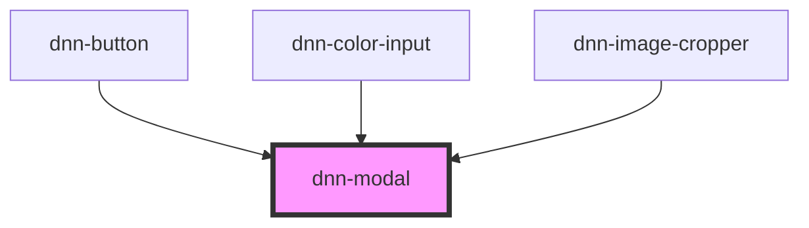

# dnn-modal

<!-- Auto Generated Below -->

## Properties

| Property                 | Attribute                  | Description                                                                                                                                                                                                                                                                                                                                                                                               | Type                   | Default         |
| ------------------------ | -------------------------- | --------------------------------------------------------------------------------------------------------------------------------------------------------------------------------------------------------------------------------------------------------------------------------------------------------------------------------------------------------------------------------------------------------- | ---------------------- | --------------- |
| `backdropDismiss`        | `backdrop-dismiss`         | **[DEPRECATED]** boolean props should always default to being false per html specs, use preventBackdropDismiss instead, will be removed in v0.28.0. Pass false to remove the backdrop click auto-dismiss feature.                                                                                                                                                  | `boolean \| undefined` | `undefined`     |
| `closeText`              | `close-text`               | Optionally pass the aria-label text for the close button. Defaults to "Close modal" if not provided.                                                                                                                                                                                                                                                                                                      | `string \| undefined`  | `"Close modal"` |
| `hideCloseButton`        | `hide-close-button`        | Optionally you can pass true to not show the close button. If you decide to do so, you should either not also prevent dismissal by clicking the backdrop or provide your own dismissal logic in the modal content.                                                                                                                                                                                        | `boolean`              | `false`         |
| `preventBackdropDismiss` | `prevent-backdrop-dismiss` | Pass true to remove the backdrop click auto-dismiss feature. Defaults to false.                                                                                                                                                                                                                                                                                                                           | `boolean \| undefined` | `false`         |
| `resizable`              | `resizable`                | If set to true, the modal becomes resizable.                                                                                                                                                                                                                                                                                                                                                              | `boolean \| undefined` | `false`         |
| `showCloseButton`        | `show-close-button`        | **[DEPRECATED]** boolean props should always default to being false per html specs, use hideCloseButton instead, will be removed in v0.28.0. Optionally you can pass false to not show the close button. If you decide to do so, you should either not also prevent dismissal by clicking the backdrop or provide your own dismissal logic in the modal content.   | `boolean \| undefined` | `undefined`     |
| `visible`                | `visible`                  | Reflects the visible state of the modal.                                                                                                                                                                                                                                                                                                                                                                  | `boolean`              | `false`         |

## Events

| Event       | Description                        | Type               |
| ----------- | ---------------------------------- | ------------------ |
| `dismissed` | Fires when the modal is dismissed. | `CustomEvent<any>` |

## Methods

### `hide() => Promise<void>`

Hides the modal

#### Returns

Type: `Promise<void>`

### `show() => Promise<void>`

Shows the modal

#### Returns

Type: `Promise<void>`

## CSS Custom Properties

| Name          | Description                      |
| ------------- | -------------------------------- |
| `--max-width` | The maximum width of the module. |

## Dependencies

### Used by

 - [dnn-button](../dnn-button)
 - [dnn-color-input](../dnn-color-input)
 - [dnn-image-cropper](../dnn-image-cropper)

### Graph

----------------------------------------------

*Built with [StencilJS](https://stenciljs.com/)*
