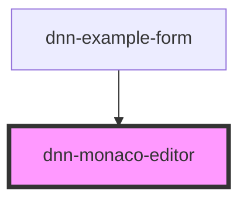

# dnn-monaco-editor


<!-- Auto Generated Below -->


## Usage

### HTML

```html
<dnn-monaco-editor
    language="html"
    value="<h1>Hello World</h1>
        <div class=&quot;card&quot;>
            <p>Some text</p>
        </div>"
>
</dnn-monaco-editor>
```


### JSX-TSX

```tsx
<dnn-monaco-editor
    language="html"
    value="<h1>Hello World</h1>
        <div class=&quot;card&quot;>
            <p>Some text</p>
        </div>"
>
</dnn-monaco-editor>
```


## Properties

| Property   | Attribute  | Description                               | Type                                                                                                                                                                                                                                                                                                                                                                                                                                    | Default     |
| ---------- | ---------- | ----------------------------------------- | --------------------------------------------------------------------------------------------------------------------------------------------------------------------------------------------------------------------------------------------------------------------------------------------------------------------------------------------------------------------------------------------------------------------------------------- | ----------- |
| `language` | `language` | Defines the language for the editor.      | `"html" \| "ruby" \| "plaintext" \| "r" \| "bat" \| "coffeescript" \| "c" \| "cpp" \| "csharp" \| "dockerfile" \| "fsharp" \| "go" \| "handlebars" \| "ini" \| "pug" \| "java" \| "lua" \| "markdown" \| "msdax" \| "objective-c" \| "postiats" \| "php" \| "powershell" \| "python" \| "razor" \| "swift" \| "sql" \| "vb" \| "xml" \| "less" \| "scss" \| "css" \| "yaml" \| "sol" \| "sb" \| "json" \| "typescript" \| "javascript"` | `"html"`    |
| `name`     | `name`     | The name of the control to use for forms. | `string`                                                                                                                                                                                                                                                                                                                                                                                                                                | `undefined` |
| `value`    | `value`    | Sets the code contained in the editor     | `string`                                                                                                                                                                                                                                                                                                                                                                                                                                | `""`        |


## Events

| Event            | Description                                            | Type                  |
| ---------------- | ------------------------------------------------------ | --------------------- |
| `contentChanged` | Emits the new value of the content when it is changed. | `CustomEvent<string>` |


## CSS Custom Properties

| Name                     | Description                           |
| ------------------------ | ------------------------------------- |
| `--monaco-editor-height` | height of the editor, default is 50vh |
| `--monaco-editor-width`  | width of the editor, default is 100%  |


## Dependencies

### Used by

 - [dnn-example-form](../examples/dnn-example-form)

### Graph


----------------------------------------------

*Built with [StencilJS](https://stenciljs.com/)*
