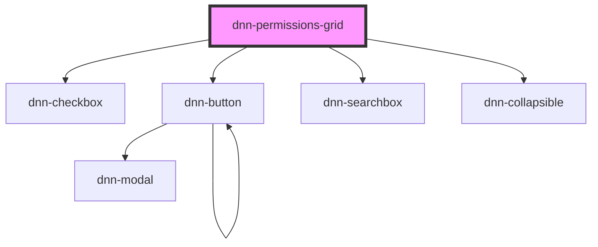

# dnn-permissions-grid

<!-- Auto Generated Below -->

## Properties

| Property                   | Attribute     | Description                                                                        | Type                         | Default     |
| -------------------------- | ------------- | ---------------------------------------------------------------------------------- | ---------------------------- | ----------- |
| `foundUsers`               | `found-users` | The list of users to show under the search users field when a search is performed. | `ISearchedUser[]`            | `[]`        |
| `permissions` _(required)_ | `permissions` | The list of permissions.                                                           | `IPermissions`               | `undefined` |
| `resx`                     | `resx`        | Optionally allows localizing the component strings.                                | `ILocalization \| undefined` | `undefined` |
| `roleGroups` _(required)_  | `role-groups` | The list of role groups.                                                           | `IRoleGroup[]`               | `undefined` |
| `roles` _(required)_       | `roles`       | The list of possible roles.                                                        | `IRole[]`                    | `undefined` |

## Events

| Event                    | Description                                                                                   | Type                        |
| ------------------------ | --------------------------------------------------------------------------------------------- | --------------------------- |
| `permissionsChanged`     | Fires when any permissions have changed, can be used for instance to have linked permissions. | `CustomEvent<IPermissions>` |
| `userSearchQueryChanged` | Fires when searching for users to add to the permissions. Emits the search query.             | `CustomEvent<string>`       |

## Dependencies

### Depends on

- [dnn-checkbox](../dnn-checkbox)
- [dnn-button](../dnn-button)
- [dnn-searchbox](../dnn-searchbox)
- [dnn-collapsible](../dnn-collapsible)

### Graph

----------------------------------------------

*Built with [StencilJS](https://stenciljs.com/)*
