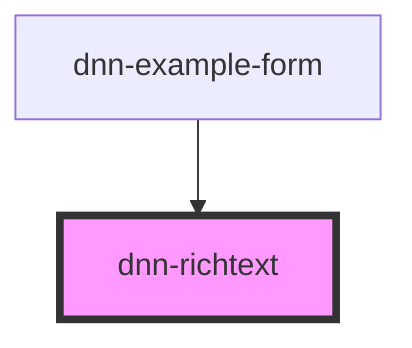

# dnn-richtext

<!-- Auto Generated Below -->

## Properties

| Property  | Attribute | Description                                                                                    | Type     | Default     |
| --------- | --------- | ---------------------------------------------------------------------------------------------- | -------- | ----------- |
| `name`    | `name`    | Name of the field when used in a form.                                                         | `string` | `undefined` |
| `options` | --        | Optional configuration for Jodit, see https://xdsoft.net/jodit/docs/classes/config.Config.html | `Config` | `undefined` |
| `value`   | `value`   | Sets the value of the content of the editor.                                                   | `string` | `undefined` |

## Events

| Event         | Description                   | Type                  |
| ------------- | ----------------------------- | --------------------- |
| `valueChange` | Fires when the value changed. | `CustomEvent<string>` |
| `valueInput`  | Fires during value input.     | `CustomEvent<string>` |

## Dependencies

### Used by

 - [dnn-example-form](../examples/dnn-example-form)

### Graph

----------------------------------------------

*Built with [StencilJS](https://stenciljs.com/)*
