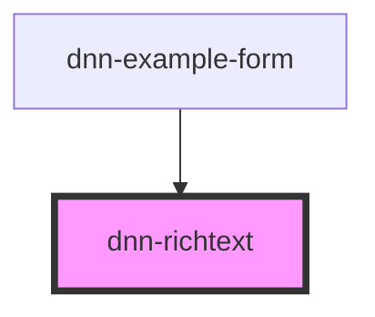

# dnn-richtext

<!-- Auto Generated Below -->

## Properties

| Property           | Attribute           | Description                                                                                                                                                                                                                                                                                                                                                                                                                                                                                                                          | Type                                                     | Default     |
| ------------------ | ------------------- | ------------------------------------------------------------------------------------------------------------------------------------------------------------------------------------------------------------------------------------------------------------------------------------------------------------------------------------------------------------------------------------------------------------------------------------------------------------------------------------------------------------------------------------ | -------------------------------------------------------- | ----------- |
| `customizeOptions` | `customize-options` | Customize the options before initializing the editor, will have all the default options merged with 'options' if passed. This is called last after merging default options with your custom 'options' and just before initializing the editor.                                                                                                                                                                                                                                                                                       | `((options: Config) => Config) \| undefined`             | `undefined` |
| `name`             | `name`              | Name of the field when used in a form.                                                                                                                                                                                                                                                                                                                                                                                                                                                                                               | `string \| undefined`                                    | `undefined` |
| `options`          | `options`           | Optional configuration for Jodit, see https://xdsoft.net/jodit/docs/classes/config.Config.html This will be merged with the default options and passed to the editor. If you prefer to not have to pass a full config object, you can use 'customizeOptions' to modify the options before initializing the editor instead of providing all options here.                                                                                                                                                                             | `Config \| undefined`                                    | `undefined` |
| `plugins`          | `plugins`           | Allows registering your own plugins. The callback will be called with the editor instance as the only argument durig initialization. All other behavior needs to be implemented in the plugin itself using editor.on("eventname"). See https://xdsoft.net/jodit/examples/plugin/custom_plugin.html for an example. Creating a plugin does NOT automatically add it to the toolbar, you need to do that yourself in 'options' or 'customizeOptions', See https://xdsoft.net/jodit/examples/toolbar/custom_button.html for an example. | `{ name: string; callback: (editor: Jodit) => void; }[]` | `[]`        |
| `value`            | `value`             | Sets the value of the content of the editor.                                                                                                                                                                                                                                                                                                                                                                                                                                                                                         | `string`                                                 | `""`        |

## Events

| Event         | Description                   | Type                  |
| ------------- | ----------------------------- | --------------------- |
| `valueChange` | Fires when the value changed. | `CustomEvent<string>` |
| `valueInput`  | Fires during value input.     | `CustomEvent<string>` |

## Dependencies

### Used by

 - [dnn-example-form](../examples/dnn-example-form)

### Graph

----------------------------------------------

*Built with [StencilJS](https://stenciljs.com/)*
