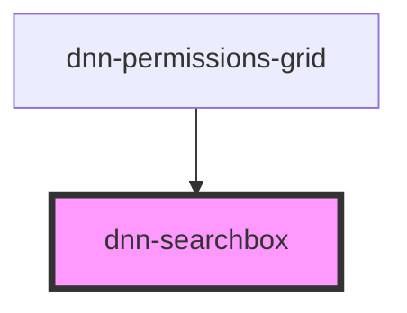

# dnn-searchbox

<!-- Auto Generated Below -->

## Properties

| Property       | Attribute       | Description                                                                                                                                                            | Type      | Default |
| -------------- | --------------- | ---------------------------------------------------------------------------------------------------------------------------------------------------------------------- | --------- | ------- |
| `debounceTime` | `debounce-time` | How many milliseconds to wait before firing the queryChanged event.                                                                                                    | `number`  | `500`   |
| `debounced`    | `debounced`     | **[DEPRECATED]** Use debounceTime (or debounce-time) instead. Will be removed in v0.25.0 Debounces the queryChanged by 500ms.   | `boolean` | `true`  |
| `placeholder`  | `placeholder`   | Sets the field placeholder text.                                                                                                                                       | `string`  | `""`    |
| `query`        | `query`         | Sets the query                                                                                                                                                         | `string`  | `""`    |

## Events

| Event          | Description                                                                    | Type                  |
| -------------- | ------------------------------------------------------------------------------ | --------------------- |
| `queryChanged` | Fires up each time the search query changes. The data passed is the new query. | `CustomEvent<string>` |

## Dependencies

### Used by

 - [dnn-permissions-grid](../dnn-permissions-grid)

### Graph

----------------------------------------------

*Built with [StencilJS](https://stenciljs.com/)*
