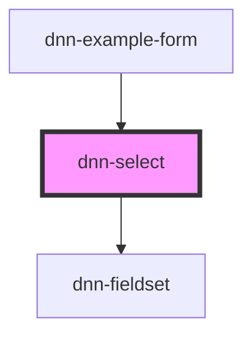

# dnn-select

<!-- Auto Generated Below -->

## Properties

| Property                   | Attribute                    | Description                                                                                                                        | Type      | Default     |
| -------------------------- | ---------------------------- | ---------------------------------------------------------------------------------------------------------------------------------- | --------- | ----------- |
| `disableValidityReporting` | `disable-validity-reporting` | **[DEPRECATED]** This control has its own validatin reporting, will be removed in v0.25.0   | `boolean` | `undefined` |
| `disabled`                 | `disabled`                   | Defines whether the field is disabled.                                                                                             | `boolean` | `undefined` |
| `helpText`                 | `help-text`                  | Defines the help label displayed under the field.                                                                                  | `string`  | `undefined` |
| `label`                    | `label`                      | The label for this input.                                                                                                          | `string`  | `undefined` |
| `name`                     | `name`                       | The name for this input, if used in forms.                                                                                         | `string`  | `undefined` |
| `required`                 | `required`                   | Defines whether the field requires having a value.                                                                                 | `boolean` | `undefined` |
| `value`                    | `value`                      | The value of the input.                                                                                                            | `string`  | `undefined` |

## Events

| Event         | Description                                                    | Type                  |
| ------------- | -------------------------------------------------------------- | --------------------- |
| `valueChange` | Fires when the value has changed and the user exits the input. | `CustomEvent<string>` |

## Methods

### `reportValidity(valid: boolean, message?: string) => Promise<void>`

Reports the element validity.

#### Parameters

| Name      | Type      | Description                                                           |
| --------- | --------- | --------------------------------------------------------------------- |
| `valid`   | `boolean` | - Whether the element is valid or not.                                |
| `message` | `string`  | - The message to show when the element is invalid, optional if valid. |

#### Returns

Type: `Promise<void>`

## CSS Custom Properties

| Name                 | Description                                              |
| -------------------- | -------------------------------------------------------- |
| `--background`       | Defines the background color.                            |
| `--control-radius`   | Defines the radius for the control corners.              |
| `--danger-color`     | Defines the danger color used for invalid data.          |
| `--focus-color`      | Defines the color when the component is focused.         |
| `--foreground`       | Defines the foreground color.                            |
| `--input-text-align` | Allows customizing the text alignment of the input text. |

## Dependencies

### Used by

 - [dnn-example-form](../examples/dnn-example-form)

### Depends on

- [dnn-fieldset](../dnn-fieldset)

### Graph

----------------------------------------------

*Built with [StencilJS](https://stenciljs.com/)*
