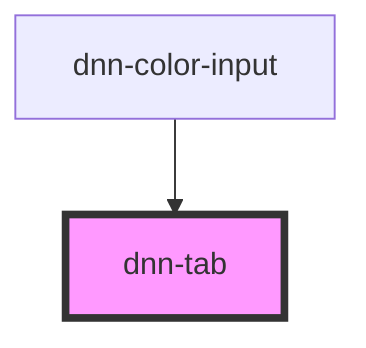

# dnn-tab

`dnn-tab` should only be used as part of `dnn-tabs` in order to define the title and content of each of the tabs.

<!-- Auto Generated Below -->


## Overview

Represents a single tab and must be used inside a dnn-tabs element.

## Usage

### HTML

```html
<dnn-tabs>
    <dnn-tab tab-title="First Tab">
        <p>Content of the first tab.</p>
    </dnn-tab>
    <dnn-tab tab-title="Second Tab">
        <p>This is the second tab</p>
    </dnn-tab>
</dnn-tabs>
```


### JSX-TSX

```tsx
<dnn-tabs>
    <dnn-tab tabTitle="First Tab">
        <p>Content of the first tab.</p>
    </dnn-tab>
    <dnn-tab tabTitle="Second Tab">
        <p>This is the second tab</p>
    </dnn-tab>
</dnn-tabs>
```


## Properties

| Property                | Attribute   | Description            | Type     | Default     |
| ----------------------- | ----------- | ---------------------- | -------- | ----------- |
| `tabTitle` _(required)_ | `tab-title` | Defines the tab title. | `string` | `undefined` |


## Methods

### `hide() => Promise<void>`

Hides the modal

#### Returns

Type: `Promise<void>`


### `show() => Promise<void>`

Shows the tab.

#### Returns

Type: `Promise<void>`


## Dependencies

### Used by

 - [dnn-color-input](../dnn-color-input)

### Graph


----------------------------------------------

*Built with [StencilJS](https://stenciljs.com/)*
