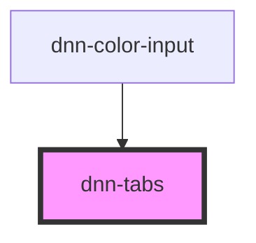

# dnn-tabs

`dnn-tabs` is a container for `dnn-tab` and should only contain `dnn-tab` elements for its content.

<!-- Auto Generated Below -->


## Usage

### HTML

```html
<dnn-tabs>
    <dnn-tab tab-title="First Tab">
        <p>Content of the first tab.</p>
    </dnn-tab>
    <dnn-tab tab-title="Second Tab">
        <p>This is the second tab</p>
    </dnn-tab>
</dnn-tabs>
```


### JSX-TSX

```tsx
<dnn-tabs>
    <dnn-tab tabTitle="First Tab">
        <p>Content of the first tab.</p>
    </dnn-tab>
    <dnn-tab tabTitle="Second Tab">
        <p>This is the second tab</p>
    </dnn-tab>
</dnn-tabs>
```


## CSS Custom Properties

| Name                   | Description                                         |
| ---------------------- | --------------------------------------------------- |
| `--color-background`   | The color of the inactive tabs.                     |
| `--color-focus`        | outline color when hovering or pre-selecting a tab. |
| `--color-text`         | The color of the text for inactive tabs.            |
| `--color-visible`      | The color of the active tab.                        |
| `--color-visible-text` | The color of the text for the active tab.           |


## Dependencies

### Used by

 - [dnn-color-input](../dnn-color-input)

### Graph


----------------------------------------------

*Built with [StencilJS](https://stenciljs.com/)*
