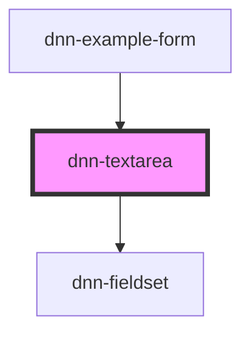

# dnn-textarea

<!-- Auto Generated Below -->

## Overview

A custom textarea component.

## Properties

| Property       | Attribute      | Description                                                                                                                               | Type                                                                    | Default     |
| -------------- | -------------- | ----------------------------------------------------------------------------------------------------------------------------------------- | ----------------------------------------------------------------------- | ----------- |
| `autocomplete` | `autocomplete` | Defines the type of auto-completion to use for this field, see https://developer.mozilla.org/en-US/docs/Web/HTML/Attributes/autocomplete. | `string`                                                                | `"off"`     |
| `disabled`     | `disabled`     | Defines whether the field is disabled.                                                                                                    | `boolean`                                                               | `undefined` |
| `helpText`     | `help-text`    | Defines the help label displayed under the field.                                                                                         | `string`                                                                | `undefined` |
| `label`        | `label`        | The label for this input.                                                                                                                 | `string`                                                                | `undefined` |
| `maxlength`    | `maxlength`    | Defines the maximum amount of charaters.                                                                                                  | `number`                                                                | `undefined` |
| `minlength`    | `minlength`    | Defines the minimum amount of charaters.                                                                                                  | `number`                                                                | `undefined` |
| `name`         | `name`         | The name for this input when used in forms.                                                                                               | `string`                                                                | `undefined` |
| `readonly`     | `readonly`     | Defines wheter the defined value is readonly.                                                                                             | `boolean`                                                               | `undefined` |
| `required`     | `required`     | Defines whether the field requires having a value.                                                                                        | `boolean`                                                               | `undefined` |
| `resizable`    | `resizable`    | Can be set to change how the user can resize the field.                                                                                   | `"block" \| "both" \| "horizontal" \| "inline" \| "none" \| "vertical"` | `"block"`   |
| `rows`         | `rows`         | Defines how many rows (lines of text) to initially show.                                                                                  | `number`                                                                | `3`         |
| `value`        | `value`        | Sets the value of the textarea.                                                                                                           | `string`                                                                | `undefined` |

## Events

| Event         | Description                                                    | Type                  |
| ------------- | -------------------------------------------------------------- | --------------------- |
| `valueChange` | Fires when the value has changed and the user exits the input. | `CustomEvent<string>` |
| `valueInput`  | Fires when the using is inputing data (on keystrokes).         | `CustomEvent<string>` |

## Methods

### `checkValidity() => Promise<ValidityState>`

Reports the input validity details. See https://developer.mozilla.org/en-US/docs/Web/API/ValidityState

#### Returns

Type: `Promise<ValidityState>`

### `setCustomValidity(message: string) => Promise<void>`

Can be used to set a custom validity message.

#### Parameters

| Name      | Type     | Description |
| --------- | -------- | ----------- |
| `message` | `string` |             |

#### Returns

Type: `Promise<void>`

## CSS Custom Properties

| Name               | Description                                      |
| ------------------ | ------------------------------------------------ |
| `--background`     | Defines the background color.                    |
| `--control-radius` | Defines the radius for the control corners.      |
| `--danger-color`   | Defines the danger color used for invalid data.  |
| `--focus-color`    | Defines the color when the component is focused. |
| `--foreground`     | Defines the foreground color.                    |

## Dependencies

### Used by

 - [dnn-example-form](../examples/dnn-example-form)

### Depends on

- [dnn-fieldset](../dnn-fieldset)

### Graph

----------------------------------------------

*Built with [StencilJS](https://stenciljs.com/)*
