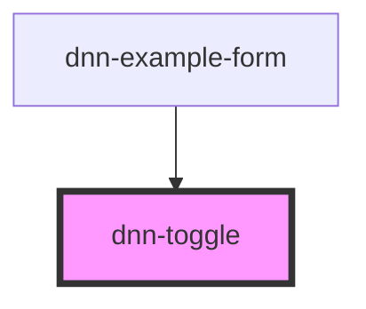

# dnn-toggle


<!-- Auto Generated Below -->


## Usage

### HTML

```html
<dnn-toggle
    checked="true"
    disabled="false"
    name="foo"
    value="on"
>
</dnn-toggle>
```


### JSX-TSX

```tsx
<dnn-toggle
    checked="true"
    disabled="false"
    name="foo"
    value="on"
>
</dnn-toggle>
```


## Properties

| Property   | Attribute  | Description                                     | Type                  | Default     |
| ---------- | ---------- | ----------------------------------------------- | --------------------- | ----------- |
| `checked`  | `checked`  | If 'true' the toggle is checked (on).           | `boolean`             | `false`     |
| `disabled` | `disabled` | If 'true' the toggle is not be interacted with. | `boolean`             | `false`     |
| `name`     | `name`     | The field name to use in forms.                 | `string \| undefined` | `undefined` |
| `value`    | `value`    | The value to post when used in forms.           | `string`              | `"on"`      |


## Events

| Event          | Description                   | Type                                      |
| -------------- | ----------------------------- | ----------------------------------------- |
| `checkChanged` | Fires when the toggle changed | `CustomEvent<DnnToggleChangeEventDetail>` |


## CSS Custom Properties

| Name                          | Description                            |
| ----------------------------- | -------------------------------------- |
| `--background`                | Background of the toggle.              |
| `--background-checked`        | Background of the toggle when checked. |
| `--border-radius`             | The radius of the background borders.  |
| `--handle-background`         | Background of the handle.              |
| `--handle-background-checked` | Background of the handle when checked. |
| `--handle-border-radius`      | The radius of the handle.              |


## Dependencies

### Used by

 - [dnn-example-form](../examples/dnn-example-form)

### Graph


----------------------------------------------

*Built with [StencilJS](https://stenciljs.com/)*
