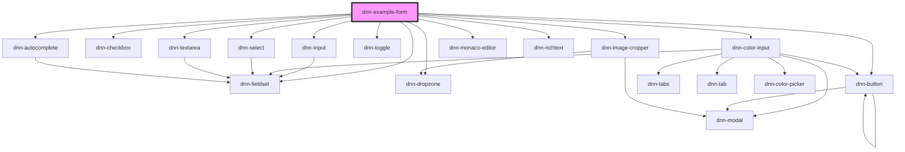

# dnn-example-form

<!-- Auto Generated Below -->

## Overview

Do not use this component in production, it is meant for testing purposes only and is not distributed in the production package.

## Dependencies

### Depends on

- [dnn-fieldset](../../dnn-fieldset)
- [dnn-input](../../dnn-input)
- [dnn-checkbox](../../dnn-checkbox)
- [dnn-color-input](../../dnn-color-input)
- [dnn-select](../../dnn-select)
- [dnn-textarea](../../dnn-textarea)
- [dnn-toggle](../../dnn-toggle)
- [dnn-autocomplete](../../dnn-autocomplete)
- [dnn-dropzone](../../dnn-dropzone)
- [dnn-image-cropper](../../dnn-image-cropper)
- [dnn-monaco-editor](../../dnn-monaco-editor)
- [dnn-richtext](../../dnn-richtext)
- [dnn-button](../../dnn-button)

### Graph

----------------------------------------------

*Built with [StencilJS](https://stenciljs.com/)*
