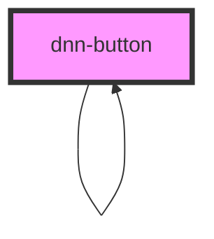

# dnn-button

<!-- Auto Generated Below -->

## Properties

| Property         | Attribute          | Description                                                                                                  | Type                                     | Default            |
| ---------------- | ------------------ | ------------------------------------------------------------------------------------------------------------ | ---------------------------------------- | ------------------ |
| `confirm`        | `confirm`          | Optionally add a confirmation dialog before firing the action.                                               | `boolean`                                | `false`            |
| `confirmMessage` | `confirm-message`  | The text of the confirmation message;                                                                        | `string`                                 | `"Are you sure ?"` |
| `confirmNoText`  | `confirm-no-text`  | The text of the no button for confirmation.                                                                  | `string`                                 | `"No"`             |
| `confirmYesText` | `confirm-yes-text` | The text of the yes button for confirmation.                                                                 | `string`                                 | `"Yes"`            |
| `disabled`       | `disabled`         | Disables the button                                                                                          | `boolean`                                | `false`            |
| `reversed`       | `reversed`         | Optionally reverses the button style.                                                                        | `boolean`                                | `false`            |
| `size`           | `size`             | Optionally sets the button size, small normal or large, defaults to normal                                   | `"large" \| "normal" \| "small"`         | `'normal'`         |
| `type`           | `type`             | Optional button style, can be either primary, secondary or tertiary and defaults to primary if not specified | `"primary" \| "secondary" \| "tertiary"` | `'primary'`        |

## Events

| Event       | Description                                                  | Type               |
| ----------- | ------------------------------------------------------------ | ------------------ |
| `canceled`  | Fires when confirm is true and the user cancels the action.  | `CustomEvent<any>` |
| `confirmed` | Fires when confirm is true and the user confirms the action. | `CustomEvent<any>` |

## Slots

| Slot                      | Description |
| ------------------------- | ----------- |
| `"Content of the button"` |             |

## Dependencies

### Used by

 - [dnn-button](.)

### Depends on

- [dnn-modal](../dnn-modal)
- [dnn-button](.)

### Graph

----------------------------------------------

*Built with [StencilJS](https://stenciljs.com/)*
