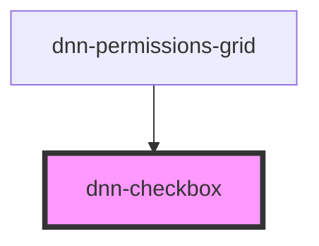

# dnn-checkbox

<!-- Auto Generated Below -->

## Properties

| Property          | Attribute          | Description                                                                                                       | Type                                         | Default       |
| ----------------- | ------------------ | ----------------------------------------------------------------------------------------------------------------- | -------------------------------------------- | ------------- |
| `checked`         | `checked`          | Defines if the checkbox is checked (true) or unchecked (false) or in an intermediate state (undefined)            | `"checked" \| "intermediate" \| "unchecked"` | `"unchecked"` |
| `useIntermediate` | `use-intermediate` | Defines if clicking the checkbox will go through the intermediate state between checked and unchecked (tri-state) | `boolean`                                    | `false`       |
| `value`           | `value`            | The value for this checkbox (not to be confused with its checked state).                                          | `string`                                     | `undefined`   |

## Events

| Event           | Description                                          | Type                                                      |
| --------------- | ---------------------------------------------------- | --------------------------------------------------------- |
| `checkedchange` | Fires up when the checkbox checked property changes. | `CustomEvent<"checked" \| "intermediate" \| "unchecked">` |

## Slots

| Slot                 | Description                                                |
| -------------------- | ---------------------------------------------------------- |
|                      | The label for the checkbox.                                |
| `"checkedicon"`      | Allows overriding the default checked icon.                |
| `"intermediateicon"` | If intermadiate state is used, allows overriding its icon. |
| `"uncheckedicon"`    | Allows overriding the unchecked icon.                      |

## Dependencies

### Used by

 - [dnn-permissions-grid](../dnn-permissions-grid)

### Graph

----------------------------------------------

*Built with [StencilJS](https://stenciljs.com/)*
