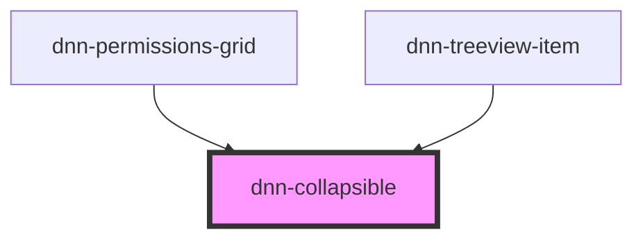

# dnn-collapsible

<!-- Auto Generated Below -->

## Properties

| Property             | Attribute             | Description                                          | Type      | Default |
| -------------------- | --------------------- | ---------------------------------------------------- | --------- | ------- |
| `expanded`           | `expanded`            | Defines if the panel is expanded or not.             | `boolean` | `false` |
| `transitionDuration` | `transition-duration` | Defines the transition time in ms, defaults to 100ms | `number`  | `150`   |

## Events

| Event                         | Description                                       | Type                |
| ----------------------------- | ------------------------------------------------- | ------------------- |
| `dnnCollapsibleHeightChanged` | Fires whenever the collapsible height has changed | `CustomEvent<void>` |

## Methods

### `updateSize() => Promise<void>`

Updates the component height, use to update after a slot content changes.

#### Returns

Type: `Promise<void>`

## Dependencies

### Used by

 - [dnn-permissions-grid](../dnn-permissions-grid)
 - [dnn-treeview-item](../dnn-treeview-item)

### Graph

----------------------------------------------

*Built with [StencilJS](https://stenciljs.com/)*
