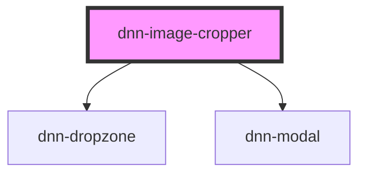

# dnn-image-cropper

<!-- Auto Generated Below -->

## Properties

| Property            | Attribute            | Description                                                                                                                                 | Type                                                                                                                                                | Default                                                                                                                                                                                                                                                                                                                                                                     |
| ------------------- | -------------------- | ------------------------------------------------------------------------------------------------------------------------------------------- | --------------------------------------------------------------------------------------------------------------------------------------------------- | --------------------------------------------------------------------------------------------------------------------------------------------------------------------------------------------------------------------------------------------------------------------------------------------------------------------------------------------------------------------------- |
| `height`            | `height`             | Sets the desired final image height.                                                                                                        | `number`                                                                                                                                            | `600`                                                                                                                                                                                                                                                                                                                                                                       |
| `preventUndersized` | `prevent-undersized` | When set to true, prevents cropping an image smaller than the required size, which would blow pixel and make the final picture look blurry. | `boolean`                                                                                                                                           | `false`                                                                                                                                                                                                                                                                                                                                                                     |
| `quality`           | `quality`            | Sets the output quality of the corpped image (number between 0 and 1).                                                                      | `number`                                                                                                                                            | `0.8`                                                                                                                                                                                                                                                                                                                                                                       |
| `resx`              | --                   | Can be used to customize controls text. Some values support tokens, see default values for examples.                                        | `{ capture: string; dragAndDropFile: string; or: string; takePicture: string; uploadFile: string; imageTooSmall: string; modalCloseText: string; }` | `{     capture: "Capture",     dragAndDropFile: "Drag and drop an image",     or: "or",     takePicture: "Take a picture",     uploadFile: "Upload an image",     imageTooSmall: "The image you are attempting to upload does not meet the minimum size requirement of {width} pixels by {height} pixels. Please upload a larger image.",     modalCloseText: "Close",   }` |
| `width`             | `width`              | Sets the desired final image width.                                                                                                         | `number`                                                                                                                                            | `600`                                                                                                                                                                                                                                                                                                                                                                       |

## Events

| Event              | Description                                                               | Type                  |
| ------------------ | ------------------------------------------------------------------------- | --------------------- |
| `imageCropChanged` | When the image crop changes, emits the dataurl for the new cropped image. | `CustomEvent<string>` |

## Dependencies

### Depends on

- [dnn-dropzone](../dnn-dropzone)
- [dnn-modal](../dnn-modal)

### Graph

----------------------------------------------

*Built with [StencilJS](https://stenciljs.com/)*
