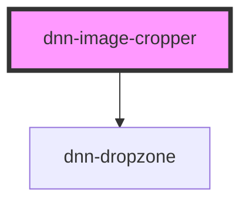

# dnn-image-cropper

<!-- Auto Generated Below -->

## Properties

| Property  | Attribute | Description                                                            | Type                                                                                                 | Default                                                                                                                                                            |
| --------- | --------- | ---------------------------------------------------------------------- | ---------------------------------------------------------------------------------------------------- | ------------------------------------------------------------------------------------------------------------------------------------------------------------------ |
| `height`  | `height`  | Sets the desired final image height.                                   | `number`                                                                                             | `600`                                                                                                                                                              |
| `quality` | `quality` | Sets the output quality of the corpped image (number between 0 and 1). | `number`                                                                                             | `0.8`                                                                                                                                                              |
| `resx`    | --        | Can be used to customize controls text.                                | `{ capture: string; dragAndDropFile: string; or: string; takePicture: string; uploadFile: string; }` | `{     capture: "Capture",     dragAndDropFile: "Drag and drop an image",     or: "or",     takePicture: "Take a picture",     uploadFile: "Upload an image",   }` |
| `width`   | `width`   | Sets the desired final image width.                                    | `number`                                                                                             | `600`                                                                                                                                                              |

## Events

| Event              | Description                                                               | Type                  |
| ------------------ | ------------------------------------------------------------------------- | --------------------- |
| `imageCropChanged` | When the image crop changes, emits the dataurl for the new cropped image. | `CustomEvent<string>` |

## Dependencies

### Depends on

- [dnn-dropzone](../dnn-dropzone)

### Graph

----------------------------------------------

*Built with [StencilJS](https://stenciljs.com/)*
