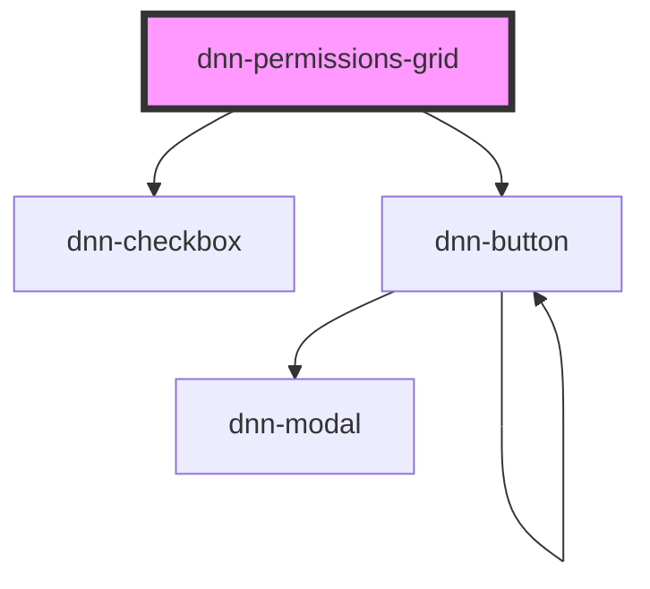

# dnn-permissions-grid

<!-- Auto Generated Below -->

## Properties

| Property                   | Attribute | Description                                         | Type            | Default                                                                                                                                                                    |
| -------------------------- | --------- | --------------------------------------------------- | --------------- | -------------------------------------------------------------------------------------------------------------------------------------------------------------------------- |
| `permissions` _(required)_ | --        | The list of permissions.                            | `IPermissions`  | `undefined`                                                                                                                                                                |
| `resx`                     | --        | Optionally allows localizing the component strings. | `ILocalization` | `{     Add: "Add",     AllRoles: "All Roles",     FilterByGroup: "Filter By Group",     GlobalRoles: "Global Roles",     Role: "Role",     SelectRole: "Select Role",   }` |
| `roleGroups` _(required)_  | --        | The list of role groups.                            | `IRoleGroup[]`  | `undefined`                                                                                                                                                                |
| `roles` _(required)_       | --        | The list of possible roles.                         | `IRole[]`       | `undefined`                                                                                                                                                                |

## Dependencies

### Depends on

- [dnn-checkbox](../dnn-checkbox)
- [dnn-button](../dnn-button)

### Graph

----------------------------------------------

*Built with [StencilJS](https://stenciljs.com/)*
