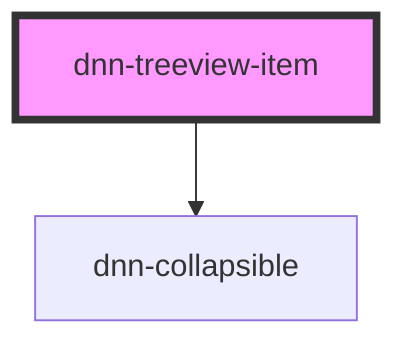

# dnn-treeview-item

<!-- Auto Generated Below -->

## Properties

| Property   | Attribute  | Description                              | Type      | Default |
| ---------- | ---------- | ---------------------------------------- | --------- | ------- |
| `expanded` | `expanded` | Defines if the current node is expanded. | `boolean` | `false` |

## Events

| Event           | Description                           | Type                |
| --------------- | ------------------------------------- | ------------------- |
| `userCollapsed` | Fires when the user collapses a node. | `CustomEvent<void>` |
| `userExpanded`  | Fires when the user expands a node.   | `CustomEvent<void>` |

## Dependencies

### Depends on

- [dnn-collapsible](../dnn-collapsible)

### Graph

----------------------------------------------

*Built with [StencilJS](https://stenciljs.com/)*
